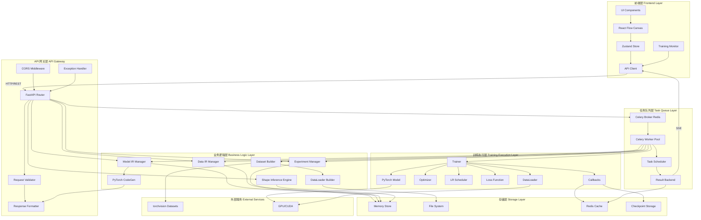
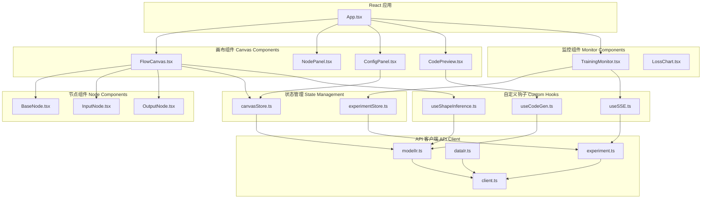
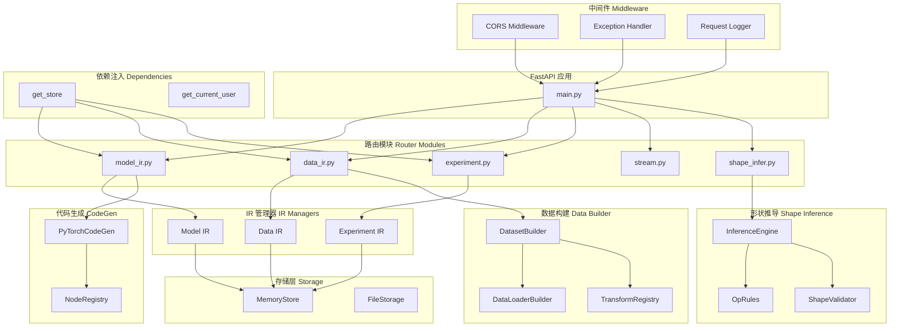
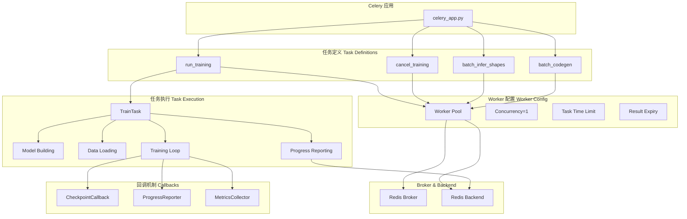
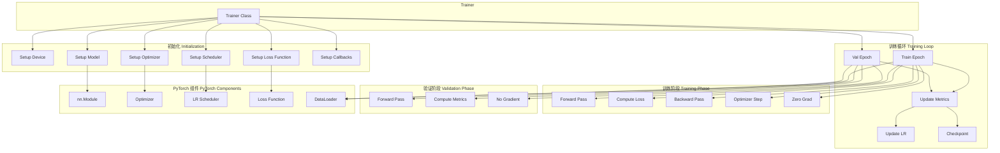
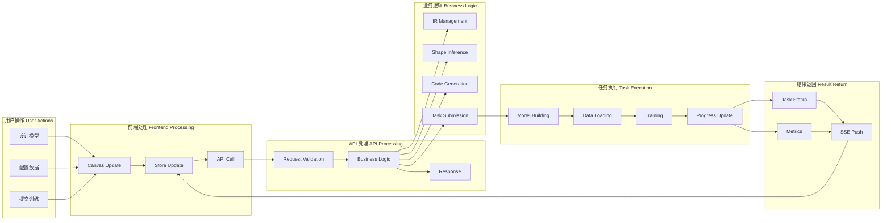
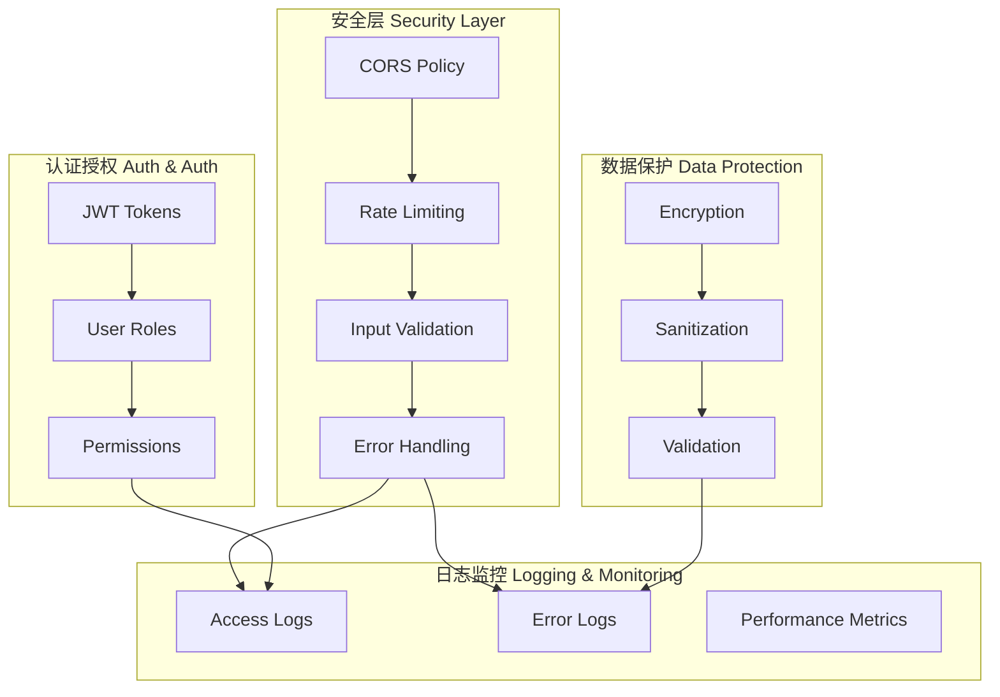
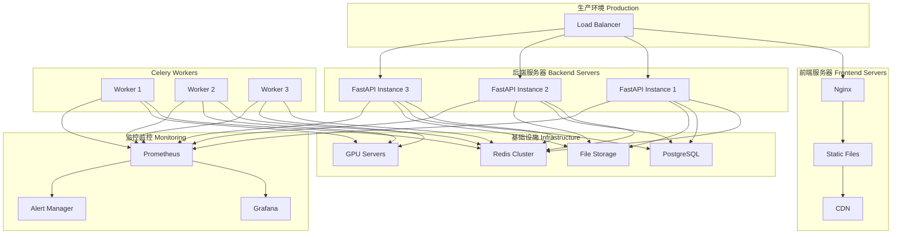
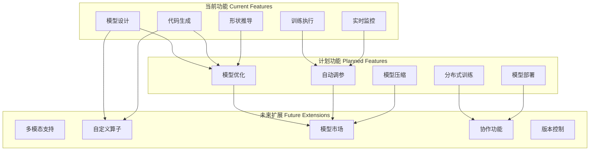

# NoCode PyTorch Platform - 系统架构图

## 📐 整体架构

```mermaid
graph TB
    subgraph "前端层 Frontend Layer"
        direction TB
        A1[React Flow Canvas]
        A2[Zustand Store]
        A3[API Client]
        A4[UI Components]
        A5[Training Monitor]
    end
    
    subgraph "API 网关层 API Gateway"
        direction TB
        B1[FastAPI Router]
        B2[Request Validator]
        B3[Response Formatter]
        B4[CORS Middleware]
        B5[Exception Handler]
    end
    
    subgraph "业务逻辑层 Business Logic Layer"
        direction TB
        C1[Model IR Manager]
        C2[Data IR Manager]
        C3[Experiment Manager]
        C4[Shape Inference Engine]
        C5[PyTorch CodeGen]
        C6[Dataset Builder]
        C7[DataLoader Builder]
    end
    
    subgraph "任务队列层 Task Queue Layer"
        direction TB
        D1[Celery Broker Redis]
        D2[Celery Worker Pool]
        D3[Task Scheduler]
        D4[Result Backend]
    end
    
    subgraph "训练执行层 Training Execution Layer"
        direction TB
        E1[Trainer]
        E2[PyTorch Model]
        E3[Optimizer]
        E4[LR Scheduler]
        E5[Loss Function]
        E6[DataLoader]
        E7[Callbacks]
    end
    
    subgraph "存储层 Storage Layer"
        direction TB
        F1[Memory Store]
        F2[File System]
        F3[Redis Cache]
        F4[Checkpoint Storage]
    end
    
    subgraph "外部服务 External Services"
        direction TB
        G1[torchvision Datasets]
        G2[GPU/CUDA]
    end
    
    A4 --> A1
    A1 --> A2
    A2 --> A3
    A5 --> A3
    
    A3 -->|HTTP/REST| B1
    B1 --> B2
    B2 --> B3
    B4 --> B1
    B5 --> B1
    
    B1 --> C1
    B1 --> C2
    B1 --> C3
    B1 --> C4
    C1 --> F1
    C2 --> F1
    C3 --> F1
    C4 --> F1
    C1 --> C5
    C5 --> B3
    
    B1 --> D1
    D1 --> D2
    D2 --> D3
    D3 --> D4
    
    D2 --> C1
    D2 --> C2
    D2 --> C3
    D2 --> C6
    C6 --> C7
    C6 --> G1
    C7 --> F2
    
    D2 --> E1
    E1 --> E2
    E1 --> E3
    E1 --> E4
    E1 --> E5
    E1 --> E6
    E1 --> E7
    
    E2 --> G2
    E6 --> G2
    
    E7 --> F4
    E7 --> F3
    
    D4 -->|SSE| A3
    D4 --> F3
```

## 🎨 前端架构

```mermaid
graph TB
    subgraph "React 应用"
        A[App.tsx]
    end
    
    subgraph "画布组件 Canvas Components"
        B1[FlowCanvas.tsx]
        B2[NodePanel.tsx]
        B3[ConfigPanel.tsx]
        B4[CodePreview.tsx]
    end
    
    subgraph "节点组件 Node Components"
        C1[BaseNode.tsx]
        C2[InputNode.tsx]
        C3[OutputNode.tsx]
    end
    
    subgraph "监控组件 Monitor Components"
        D1[TrainingMonitor.tsx]
        D2[LossChart.tsx]
    end
    
    subgraph "状态管理 State Management"
        E1[canvasStore.ts]
        E2[experimentStore.ts]
    end
    
    subgraph "自定义钩子 Custom Hooks"
        F1[useCodeGen.ts]
        F2[useShapeInference.ts]
        F3[useSSE.ts]
    end
    
    subgraph "API 客户端 API Client"
        G1[modelIr.ts]
        G2[dataIr.ts]
        G3[experiment.ts]
        G4[client.ts]
    end
    
    A --> B1
    A --> B2
    A --> B3
    A --> B4
    A --> D1
    
    B1 --> C1
    B1 --> C2
    B1 --> C3
    
    B1 --> E1
    B3 --> E1
    D1 --> E2
    
    B4 --> F1
    B1 --> F2
    D1 --> F3
    
    F1 --> G1
    F2 --> G1
    F3 --> G3
    
    E1 --> G1
    E2 --> G3
    
    G1 --> G4
    G2 --> G4
    G3 --> G4
```

## 🖥️ 后端架构

```mermaid
graph TB
    subgraph "FastAPI 应用"
        A[main.py]
    end
    
    subgraph "路由模块 Router Modules"
        B1[model_ir.py]
        B2[data_ir.py]
        B3[experiment.py]
        B4[stream.py]
        B5[shape_infer.py]
    end
    
    subgraph "中间件 Middleware"
        C1[CORS Middleware]
        C2[Exception Handler]
        C3[Request Logger]
    end
    
    subgraph "依赖注入 Dependencies"
        D1[get_store]
        D2[get_current_user]
    end
    
    subgraph "IR 管理器 IR Managers"
        E1[Model IR]
        E2[Data IR]
        E3[Experiment IR]
    end
    
    subgraph "代码生成 CodeGen"
        F1[PyTorchCodeGen]
        F2[NodeRegistry]
    end
    
    subgraph "形状推导 Shape Inference"
        G1[InferenceEngine]
        G2[OpRules]
        G3[ShapeValidator]
    end
    
    subgraph "数据构建 Data Builder"
        H1[DatasetBuilder]
        H2[DataLoaderBuilder]
        H3[TransformRegistry]
    end
    
    subgraph "存储层 Storage"
        I1[MemoryStore]
        I2[FileStorage]
    end
    
    A --> B1
    A --> B2
    A --> B3
    A --> B4
    A --> B5
    
    C1 --> A
    C2 --> A
    C3 --> A
    
    D1 --> B1
    D1 --> B2
    D1 --> B3
    
    B1 --> E1
    B2 --> E2
    B3 --> E3
    B5 --> G1
    
    B1 --> F1
    F1 --> F2
    
    G1 --> G2
    G1 --> G3
    
    B2 --> H1
    H1 --> H2
    H1 --> H3
    
    E1 --> I1
    E2 --> I1
    E3 --> I1
```

## ⚡ 任务队列架构

```mermaid
graph TB
    subgraph "Celery 应用"
        A[celery_app.py]
    end
    
    subgraph "任务定义 Task Definitions"
        B1[run_training]
        B2[cancel_training]
        B3[batch_infer_shapes]
        B4[batch_codegen]
    end
    
    subgraph "Worker 配置 Worker Config"
        C1[Worker Pool]
        C2[Concurrency=1]
        C3[Task Time Limit]
        C4[Result Expiry]
    end
    
    subgraph "Broker & Backend"
        D1[Redis Broker]
        D2[Redis Backend]
    end
    
    subgraph "任务执行 Task Execution"
        E1[TrainTask]
        E2[Model Building]
        E3[Data Loading]
        E4[Training Loop]
        E5[Progress Reporting]
    end
    
    subgraph "回调机制 Callbacks"
        F1[CheckpointCallback]
        F2[ProgressReporter]
        F3[MetricsCollector]
    end
    
    A --> B1
    A --> B2
    A --> B3
    A --> B4
    
    B1 --> C1
    B2 --> C1
    B3 --> C1
    B4 --> C1
    
    C1 --> D1
    C1 --> D2
    
    B1 --> E1
    E1 --> E2
    E1 --> E3
    E1 --> E4
    E1 --> E5
    
    E4 --> F1
    E4 --> F2
    E4 --> F3
    
    E5 --> D2
```

## 🏋️ 训练架构

```mermaid
graph TB
    subgraph "Trainer"
        A[Trainer Class]
    end
    
    subgraph "初始化 Initialization"
        B1[Setup Device]
        B2[Setup Model]
        B3[Setup Optimizer]
        B4[Setup Scheduler]
        B5[Setup Loss Function]
        B6[Setup Callbacks]
    end
    
    subgraph "训练循环 Training Loop"
        C1[Train Epoch]
        C2[Val Epoch]
        C3[Update Metrics]
        C4[Update LR]
        C5[Checkpoint]
    end
    
    subgraph "训练阶段 Training Phase"
        D1[Forward Pass]
        D2[Compute Loss]
        D3[Backward Pass]
        D4[Optimizer Step]
        D5[Zero Grad]
    end
    
    subgraph "验证阶段 Validation Phase"
        E1[Forward Pass]
        E2[Compute Metrics]
        E3[No Gradient]
    end
    
    subgraph "PyTorch 组件 PyTorch Components"
        F1[nn.Module]
        F2[Optimizer]
        F3[LR Scheduler]
        F4[Loss Function]
        F5[DataLoader]
    end
    
    A --> B1
    A --> B2
    A --> B3
    A --> B4
    A --> B5
    A --> B6
    
    A --> C1
    A --> C2
    C1 --> C3
    C2 --> C3
    C3 --> C4
    C3 --> C5
    
    C1 --> D1
    C1 --> D2
    C1 --> D3
    C1 --> D4
    C1 --> D5
    
    C2 --> E1
    C2 --> E2
    C2 --> E3
    
    B2 --> F1
    B3 --> F2
    B4 --> F3
    B5 --> F4
    C1 --> F5
    C2 --> F5
```

## 📊 数据流架构

```mermaid
graph LR
    subgraph "用户操作 User Actions"
        A1[设计模型]
        A2[配置数据]
        A3[提交训练]
    end
    
    subgraph "前端处理 Frontend Processing"
        B1[Canvas Update]
        B2[Store Update]
        B3[API Call]
    end
    
    subgraph "API 处理 API Processing"
        C1[Request Validation]
        C2[Business Logic]
        C3[Response]
    end
    
    subgraph "业务逻辑 Business Logic"
        D1[IR Management]
        D2[Shape Inference]
        D3[Code Generation]
        D4[Task Submission]
    end
    
    subgraph "任务执行 Task Execution"
        E1[Model Building]
        E2[Data Loading]
        E3[Training]
        E4[Progress Update]
    end
    
    subgraph "结果返回 Result Return"
        F1[Task Status]
        F2[Metrics]
        F3[SSE Push]
    end
    
    A1 --> B1
    A2 --> B1
    A3 --> B1
    
    B1 --> B2
    B2 --> B3
    
    B3 --> C1
    C1 --> C2
    C2 --> C3
    
    C2 --> D1
    C2 --> D2
    C2 --> D3
    C2 --> D4
    
    D4 --> E1
    E1 --> E2
    E2 --> E3
    E3 --> E4
    
    E4 --> F1
    E4 --> F2
    F1 --> F3
    F2 --> F3
    F3 --> B2
```

## 🔒 安全架构

```mermaid
graph TB
    subgraph "安全层 Security Layer"
        A1[CORS Policy]
        A2[Rate Limiting]
        A3[Input Validation]
        A4[Error Handling]
    end
    
    subgraph "认证授权 Auth & Auth"
        B1[JWT Tokens]
        B2[User Roles]
        B3[Permissions]
    end
    
    subgraph "数据保护 Data Protection"
        C1[Encryption]
        C2[Sanitization]
        C3[Validation]
    end
    
    subgraph "日志监控 Logging & Monitoring"
        D1[Access Logs]
        D2[Error Logs]
        D3[Performance Metrics]
    end
    
    A1 --> A2
    A2 --> A3
    A3 --> A4
    
    B1 --> B2
    B2 --> B3
    
    C1 --> C2
    C2 --> C3
    
    A4 --> D1
    A4 --> D2
    B3 --> D1
    C3 --> D2
```

## 🚀 部署架构

```mermaid
graph TB
    subgraph "生产环境 Production"
        A[Load Balancer]
    end
    
    subgraph "前端服务器 Frontend Servers"
        B1[Nginx]
        B2[Static Files]
        B3[CDN]
    end
    
    subgraph "后端服务器 Backend Servers"
        C1[FastAPI Instance 1]
        C2[FastAPI Instance 2]
        C3[FastAPI Instance 3]
    end
    
    subgraph "Celery Workers"
        D1[Worker 1]
        D2[Worker 2]
        D3[Worker 3]
    end
    
    subgraph "基础设施 Infrastructure"
        E1[Redis Cluster]
        E2[PostgreSQL]
        E3[File Storage]
        E4[GPU Servers]
    end
    
    subgraph "监控监控 Monitoring"
        F1[Prometheus]
        F2[Grafana]
        F3[Alert Manager]
    end
    
    A --> B1
    A --> C1
    A --> C2
    A --> C3
    
    B1 --> B2
    B2 --> B3
    
    C1 --> E1
    C2 --> E1
    C3 --> E1
    C1 --> E2
    C2 --> E2
    C3 --> E2
    
    D1 --> E1
    D2 --> E1
    D3 --> E1
    D1 --> E4
    D2 --> E4
    D3 --> E4
    
    C1 --> E3
    C2 --> E3
    C3 --> E3
    
    C1 --> F1
    C2 --> F1
    C3 --> F1
    D1 --> F1
    D2 --> F1
    D3 --> F1
    
    F1 --> F2
    F1 --> F3
```

## 📈 扩展架构

```mermaid
graph TB
    subgraph "当前功能 Current Features"
        A1[模型设计]
        A2[代码生成]
        A3[形状推导]
        A4[训练执行]
        A5[实时监控]
    end
    
    subgraph "计划功能 Planned Features"
        B1[模型优化]
        B2[自动调参]
        B3[模型压缩]
        B4[分布式训练]
        B5[模型部署]
    end
    
    subgraph "未来扩展 Future Extensions"
        C1[多模态支持]
        C2[自定义算子]
        C3[模型市场]
        C4[协作功能]
        C5[版本控制]
    end
    
    A1 --> B1
    A2 --> B1
    A3 --> B1
    A4 --> B2
    A5 --> B2
    
    B1 --> C3
    B2 --> C3
    B3 --> C3
    B4 --> C4
    B5 --> C4
    
    A1 --> C2
    A2 --> C2
```

---

**最后更新**：2025-04-09