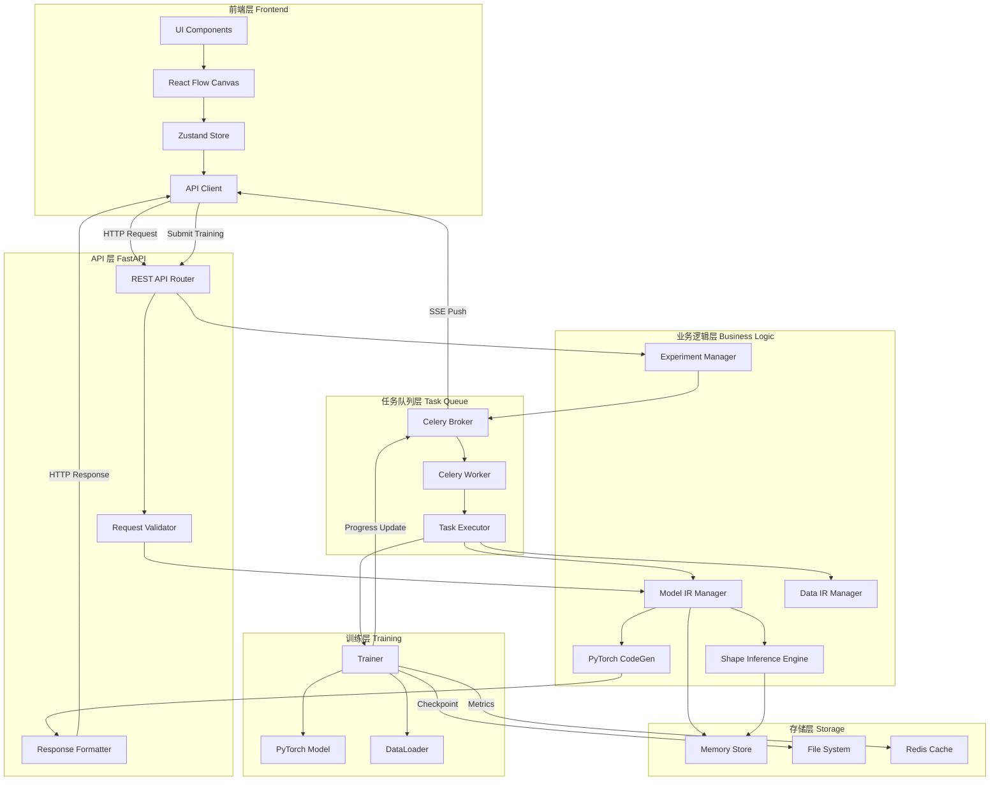
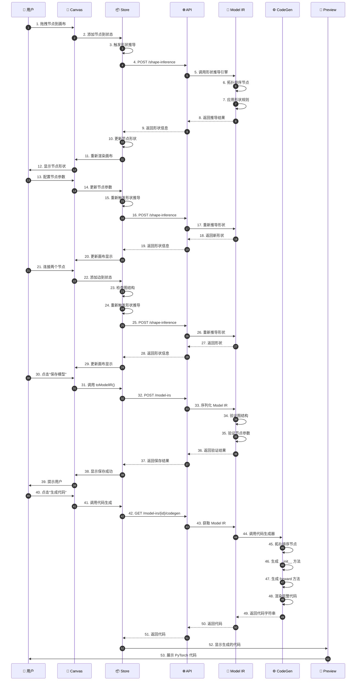
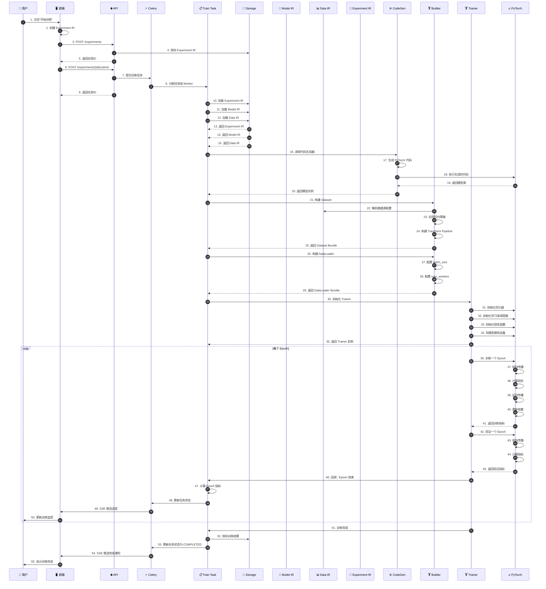
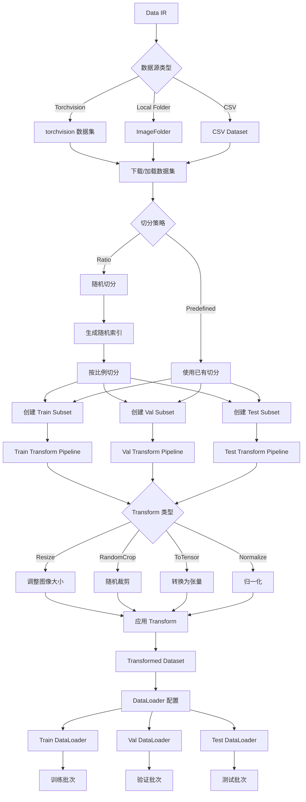
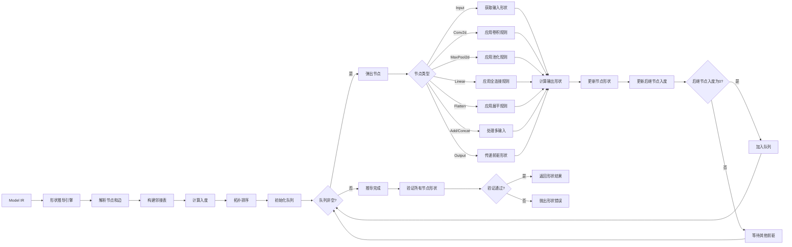
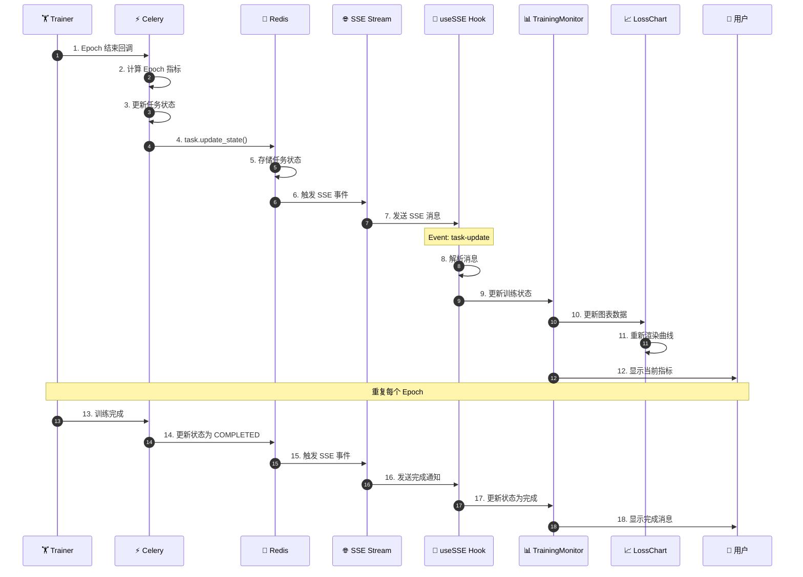

# NoCode PyTorch Platform - 数据流文档

## 📊 目录

- [整体数据流](#整体数据流)
- [模型设计数据流](#模型设计数据流)
- [训练执行数据流](#训练执行数据流)
- [数据处理数据流](#数据处理数据流)
- [形状推导数据流](#形状推导数据流)
- [实时监控数据流](#实时监控数据流)

---

## 整体数据流

### 系统级数据流图



### 数据流说明

1. **前端交互流**：用户在 React Flow Canvas 中操作，状态存储在 Zustand Store，通过 API Client 发送 HTTP 请求
2. **API 处理流**：FastAPI 接收请求，验证数据，调用业务逻辑层
3. **IR 管理流**：Model IR、Data IR、Experiment IR 在内存存储中管理
4. **形状推导流**：Shape Inference Engine 推导每层的输入输出形状
5. **代码生成流**：PyTorch CodeGen 将 Model IR 转换为可执行代码
6. **训练任务流**：Celery 接收训练任务，Worker 执行训练
7. **训练执行流**：Trainer 使用 PyTorch Model 和 DataLoader 执行训练
8. **进度推送流**：训练进度通过 Celery Broker 推送到前端
9. **结果存储流**：检查点和指标存储到文件系统和 Redis

---

## 模型设计数据流

### 详细流程图



### 数据结构转换

#### 1. Canvas Node → IRNode
```typescript
// 前端 Canvas Node
interface CanvasNode {
  id: string;
  type: string;
  position: { x: number; y: number };
  data: {
    irNode: IRNode;
    label: string;
  };
}

// 转换为后端 IRNode
interface IRNode {
  id: string;
  op_type: OpType;
  name: string;
  params: Record<string, any>;
  position?: { x: number; y: number };
  output_shape?: number[];
}
```

#### 2. Canvas Edge → IREdge
```typescript
// 前端 Canvas Edge
interface CanvasEdge {
  id: string;
  source: string;
  target: string;
  sourceHandle?: string;
  targetHandle?: string;
}

// 转换为后端 IREdge
interface IREdge {
  id: string;
  source: string;
  target: string;
  source_handle?: string;
  target_handle?: string;
}
```

#### 3. Model IR → PyTorch Code
```python
# Model IR 结构
ModelIR(
    id="model-001",
    name="Simple Cnn",
    nodes=[
        IRNode(id="n0", op_type=OpType.INPUT, name="input", params={"shape": [3, 32, 32]}),
        IRNode(id="n1", op_type=OpType.CONV2D, name="conv1", params={"in_channels": 3, "out_channels": 16, "kernel_size": 3}),
        IRNode(id="n2", op_type=OpType.RELU, name="relu1", params={}),
        IRNode(id="n3", op_type=OpType.OUTPUT, name="output", params={}),
    ],
    edges=[
        IREdge(id="e01", source="n0", target="n1"),
        IREdge(id="e12", source="n1", target="n2"),
        IREdge(id="e23", source="n2", target="n3"),
    ]
)

# 生成的 PyTorch 代码
class SimpleCnn(nn.Module):
    def __init__(self):
        super().__init__()
        self.conv1 = nn.Conv2d(3, 16, kernel_size=3)
        self.relu1 = nn.ReLU(inplace=True)
    
    def forward(self, x: torch.Tensor) -> torch.Tensor:
        x = self.conv1(x)
        x = self.relu1(x)
        return x
```

---

## 训练执行数据流

### 详细流程图



### 训练数据流

#### 1. 数据加载流
```
Data IR → DatasetBuilder → DatasetBundle
    ↓
    ├─ Train Dataset
    │   └─ Train Transform Pipeline
    │       └─ Train DataLoader
    │           └─ Train Batches
    │
    ├─ Val Dataset
    │   └─ Val Transform Pipeline
    │       └─ Val DataLoader
    │           └─ Val Batches
    │
    └─ Test Dataset
        └─ Test Transform Pipeline
            └─ Test DataLoader
                └─ Test Batches
```

#### 2. 训练循环流
```
for epoch in range(epochs):
    # 训练阶段
    for batch in train_loader:
        images, labels = batch
        images = images.to(device)
        labels = labels.to(device)
        
        # 前向传播
        outputs = model(images)
        loss = criterion(outputs, labels)
        
        # 反向传播
        optimizer.zero_grad()
        loss.backward()
        optimizer.step()
    
    # 验证阶段
    for batch in val_loader:
        images, labels = batch
        images = images.to(device)
        labels = labels.to(device)
        
        outputs = model(images)
        loss = criterion(outputs, labels)
        
        # 计算指标
        accuracy = calculate_accuracy(outputs, labels)
    
    # 学习率调度
    scheduler.step()
    
    # 回调
    on_epoch_end(EpochMetrics)
```

#### 3. 进度上报流
```
EpochMetrics → Celery Task.update_state()
    ↓
    Redis Backend
    ↓
    SSE Stream
    ↓
    Frontend useSSE Hook
    ↓
    TrainingMonitor Component
    ↓
    LossChart Component
```

---

## 数据处理数据流

### 详细流程图



### Transform Pipeline 数据流

#### 1. Train Pipeline
```
原始图像
    ↓
RandomHorizontalFlip(p=0.5)
    ↓
RandomCrop(size=32, padding=4)
    ↓
ToTensor()
    ↓
Normalize(mean=[0.4914, 0.4822, 0.4465], std=[0.2470, 0.2435, 0.2616])
    ↓
训练张量 (C, H, W)
```

#### 2. Val Pipeline
```
原始图像
    ↓
ToTensor()
    ↓
Normalize(mean=[0.4914, 0.4822, 0.4465], std=[0.2470, 0.2435, 0.2616])
    ↓
验证张量 (C, H, W)
```

### DataLoader 数据流

#### 1. 批次处理
```
Dataset → DataLoader
    ↓
    ├─ batch_size=64
    ├─ shuffle=True (train) / False (val)
    ├─ num_workers=2
    └─ pin_memory=True
    ↓
Batch Iterator
    ↓
每个 Batch:
    ├─ images: (64, 3, 32, 32) torch.Tensor
    ├─ labels: (64,) torch.Tensor
    └─ 移到设备: images.to(device), labels.to(device)
```

---

## 形状推导数据流

### 详细流程图



### 形状规则示例

#### 1. Conv2d 形状规则
```python
def conv2d_shape_rule(input_shape: list[int], params: dict) -> list[int]:
    """
    输入: [C_in, H_in, W_in]
    参数: {
        out_channels: C_out,
        kernel_size: K,
        stride: S,
        padding: P,
        dilation: D
    }
    输出: [C_out, H_out, W_out]
    """
    C_in, H_in, W_in = input_shape
    C_out = params['out_channels']
    K = params['kernel_size']
    S = params['stride']
    P = params['padding']
    D = params['dilation']
    
    # 计算输出高度和宽度
    H_out = (H_in + 2 * P - D * (K - 1) - 1) // S + 1
    W_out = (W_in + 2 * P - D * (K - 1) - 1) // S + 1
    
    return [C_out, H_out, W_out]
```

#### 2. MaxPool2d 形状规则
```python
def maxpool2d_shape_rule(input_shape: list[int], params: dict) -> list[int]:
    """
    输入: [C, H_in, W_in]
    参数: {
        kernel_size: K,
        stride: S,
        padding: P
    }
    输出: [C, H_out, W_out]
    """
    C, H_in, W_in = input_shape
    K = params['kernel_size']
    S = params['stride'] if params['stride'] else K
    P = params['padding']
    
    H_out = (H_in + 2 * P - K) // S + 1
    W_out = (W_in + 2 * P - K) // S + 1
    
    return [C, H_out, W_out]
```

#### 3. Linear 形状规则
```python
def linear_shape_rule(input_shape: list[int], params: dict) -> list[int]:
    """
    输入: [in_features] 或 [C, H, W]
    参数: {
        in_features: in_f,
        out_features: out_f
    }
    输出: [out_f]
    """
    in_f = params['in_features']
    out_f = params['out_features']
    
    # 如果输入是 3D，展平为 1D
    if len(input_shape) == 3:
        in_f = input_shape[0] * input_shape[1] * input_shape[2]
    
    return [out_f]
```

#### 4. Flatten 形状规则
```python
def flatten_shape_rule(input_shape: list[int], params: dict) -> list[int]:
    """
    输入: [C, H, W]
    参数: {
        start_dim: start,
        end_dim: end
    }
    输出: [C * H * W]
    """
    start = params.get('start_dim', 1)
    end = params.get('end_dim', -1)
    
    # 计算展平后的维度
    flattened_dim = 1
    for i in range(start, len(input_shape) if end == -1 else end + 1):
        flattened_dim *= input_shape[i]
    
    return [flattened_dim]
```

#### 5. Add 形状规则
```python
def add_shape_rule(input_shapes: list[list[int]], params: dict) -> list[int]:
    """
    输入: [[C, H, W], [C, H, W], ...]
    输出: [C, H, W]
    """
    # 所有输入形状必须相同
    first_shape = input_shapes[0]
    for shape in input_shapes[1:]:
        if shape != first_shape:
            raise ShapeError("Add 操作要求所有输入形状相同")
    
    return first_shape
```

#### 6. Concat 形状规则
```python
def concat_shape_rule(input_shapes: list[list[int]], params: dict) -> list[int]:
    """
    输入: [[C1, H, W], [C2, H, W], ...]
    参数: {
        dim: d  # 默认为 1 (通道维度)
    }
    输出: [C1 + C2 + ..., H, W]
    """
    dim = params.get('dim', 1)
    
    # 检查除拼接维度外其他维度是否相同
    first_shape = input_shapes[0]
    for shape in input_shapes[1:]:
        for i, (s1, s2) in enumerate(zip(first_shape, shape)):
            if i != dim and s1 != s2:
                raise ShapeError(f"Concat 操作要求除维度 {dim} 外其他维度相同")
    
    # 计算拼接后的形状
    output_shape = list(first_shape)
    output_shape[dim] = sum(shape[dim] for shape in input_shapes)
    
    return output_shape
```

---

## 实时监控数据流

### 详细流程图



### SSE 消息格式

#### 1. 训练进度消息
```json
{
  "event": "task-update",
  "data": {
    "experiment_id": "exp-001",
    "status": "running",
    "current_epoch": 5,
    "total_epochs": 10,
    "train_loss": 0.5234,
    "train_acc": 0.8123,
    "val_loss": 0.6789,
    "val_acc": 0.7856,
    "lr": 0.0005
  }
}
```

#### 2. 训练完成消息
```json
{
  "event": "task-completed",
  "data": {
    "experiment_id": "exp-001",
    "status": "completed",
    "result": {
      "best_val_acc": 0.8234,
      "best_val_loss": 0.5123,
      "best_epoch": 8,
      "total_epochs": 10,
      "best_ckpt_path": "./checkpoints/exp-001/best.pt"
    }
  }
}
```

#### 3. 训练失败消息
```json
{
  "event": "task-failed",
  "data": {
    "experiment_id": "exp-001",
    "status": "failed",
    "error": "CUDA out of memory"
  }
}
```

### 图表数据流

#### 1. LossChart 数据结构
```typescript
interface ChartData {
  epoch: number;
  trainLoss: number;
  valLoss: number;
  trainAcc: number;
  valAcc: number;
  lr: number;
}

interface TrainingState {
  currentEpoch: number;
  totalEpochs: number;
  history: ChartData[];
  bestValAcc: number;
  bestEpoch: number;
}
```

#### 2. 图表更新流程
```
新 Epoch 指标
    ↓
添加到 history 数组
    ↓
更新 bestValAcc 和 bestEpoch
    ↓
触发 Recharts 重新渲染
    ↓
显示训练曲线
```

---

## 数据流优化

### 1. 缓存策略

#### 形状推导缓存
```python
# 缓存键：节点ID + 输入形状
cache_key = f"{node_id}:{hash(tuple(input_shape))}"

# 检查缓存
if cache_key in shape_cache:
    return shape_cache[cache_key]

# 计算形状
output_shape = compute_shape(input_shape, params)

# 存入缓存
shape_cache[cache_key] = output_shape
```

#### 代码生成缓存
```python
# 缓存键：Model IR 的 hash
cache_key = f"codegen:{hash(model_ir.model_dump_json())}"

# 检查缓存
if cache_key in codegen_cache:
    return codegen_cache[cache_key]

# 生成代码
code = PyTorchCodeGen(model_ir).generate()

# 存入缓存
codegen_cache[cache_key] = code
```

### 2. 批量处理

#### 批量形状推导
```python
# 一次推导所有节点形状
def batch_infer_shapes(model_ir: ModelIR) -> dict[str, list[int]]:
    shape_map = {}
    for node in model_ir.nodes:
        shape_map[node.id] = infer_node_shape(node, shape_map)
    return shape_map
```

#### 批量代码生成
```python
# 一次生成多个模型的代码
def batch_codegen(model_irs: list[ModelIR]) -> dict[str, str]:
    code_map = {}
    for ir in model_irs:
        code_map[ir.id] = PyTorchCodeGen(ir).generate()
    return code_map
```

### 3. 异步处理

#### 异步形状推导
```python
@celery_app.task(name="tasks.shape_inference.batch_infer")
def batch_infer_shapes_async(model_ir_ids: list[str]) -> dict[str, dict]:
    results = {}
    for ir_id in model_ir_ids:
        model_ir = get_model_ir(ir_id)
        shapes = infer_shapes(model_ir)
        results[ir_id] = shapes
    return results
```

#### 异步代码生成
```python
@celery_app.task(name="tasks.codegen.batch_generate")
def batch_codegen_async(model_ir_ids: list[str]) -> dict[str, str]:
    results = {}
    for ir_id in model_ir_ids:
        model_ir = get_model_ir(ir_id)
        code = PyTorchCodeGen(model_ir).generate()
        results[ir_id] = code
    return results
```

---

## 错误处理数据流

### 1. 形状推导错误
```
形状推导失败
    ↓
捕获 ShapeError
    ↓
返回错误信息
    ↓
前端显示错误提示
    ↓
用户修正模型结构
```

### 2. 训练错误
```
训练过程出错
    ↓
捕获异常
    ↓
记录错误日志
    ↓
更新任务状态为 FAILED
    ↓
SSE 推送错误通知
    ↓
前端显示错误消息
```

### 3. 数据加载错误
```
数据集加载失败
    ↓
捕获 DatasetError
    ↓
返回错误信息
    ↓
前端显示错误提示
    ↓
用户修正数据配置
```

---

## 性能监控数据流

### 1. 训练性能指标
```
每个 Epoch 记录:
    ├─ 训练时间
    ├─ 验证时间
    ├─ 数据加载时间
    ├─ 前向传播时间
    ├─ 反向传播时间
    └─ 内存使用量
```

### 2. 系统性能指标
```
实时监控:
    ├─ CPU 使用率
    ├─ GPU 使用率
    ├─ 内存使用量
    ├─ 磁盘 I/O
    └─ 网络流量
```

---

**最后更新**：2025-04-09