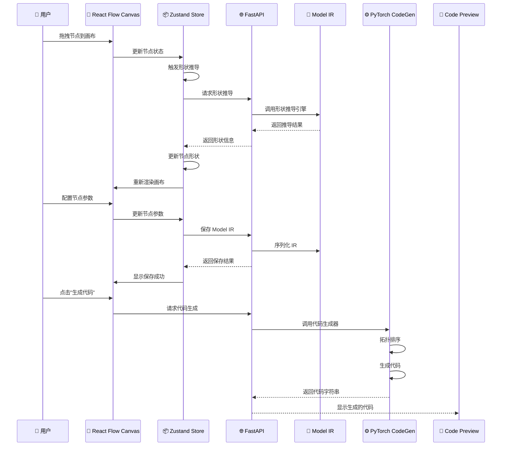
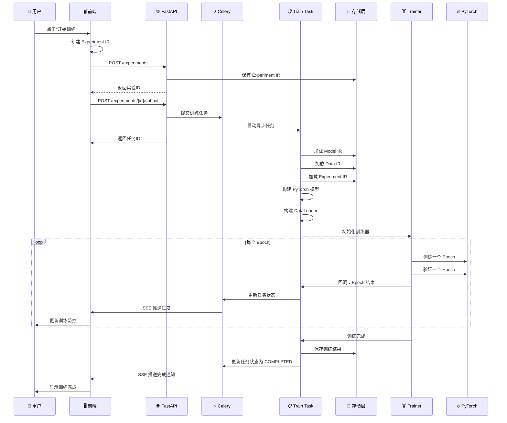
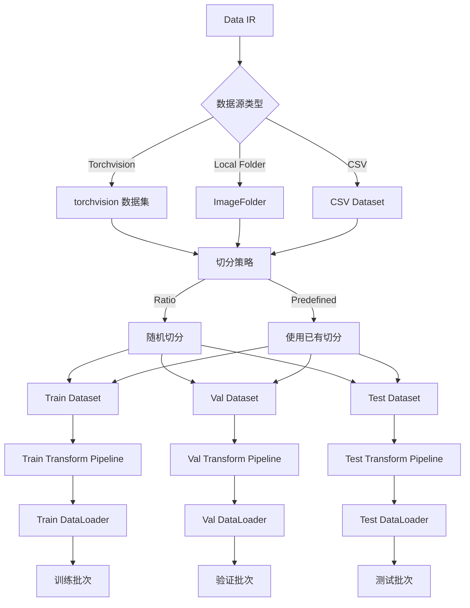
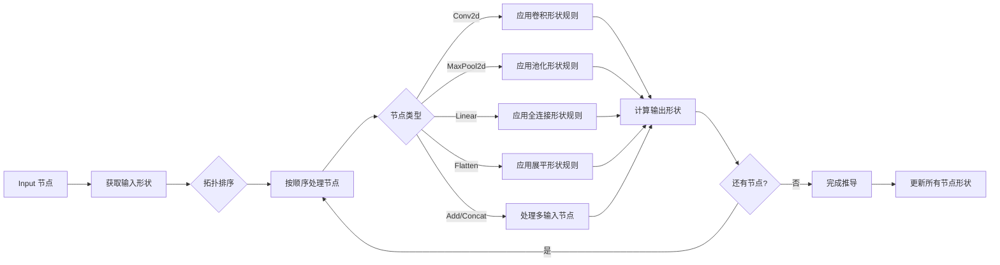

# NoCode PyTorch Platform - 项目文档

## 📋 目录

- [项目概述](#项目概述)
- [系统架构](#系统架构)
- [核心模块](#核心模块)
- [数据流](#数据流)
- [API 文档](#api-文档)
- [前端架构](#前端架构)
- [后端架构](#后端架构)
- [部署指南](#部署指南)
- [开发指南](#开发指南)

---

## 项目概述

### 🎯 项目目标

NoCode PyTorch Platform 是一个无代码深度学习平台，允许用户通过可视化界面设计神经网络架构、配置数据处理流程，并一键启动训练任务。

### ✨ 核心特性

- **可视化模型设计**：基于 React Flow 的拖拽式神经网络编辑器
- **自动代码生成**：将可视化模型转换为可执行的 PyTorch 代码
- **形状推导**：自动推导每层的输入输出形状
- **数据处理流水线**：支持多种数据源和变换操作
- **异步训练**：基于 Celery 的分布式任务调度
- **实时监控**：训练进度实时可视化

### 🏗️ 技术栈

#### 前端
- **框架**：React 18 + TypeScript
- **构建工具**：Vite 5
- **可视化**：React Flow 11
- **状态管理**：Zustand + Immer
- **HTTP 客户端**：Axios
- **图表**：Recharts

#### 后端
- **Web 框架**：FastAPI
- **深度学习**：PyTorch
- **任务队列**：Celery + Redis
- **数据验证**：Pydantic
- **数据集**：torchvision

---

## 系统架构

### 整体架构图

```
┌─────────────────────────────────────────────────────────────────┐
│                      前端 (Frontend)                      │
│  ┌──────────────┐  ┌──────────────┐  ┌──────────────┐ │
│  │  React Flow  │  │   Zustand    │  │   Recharts   │ │
│  │  Canvas      │  │   Store      │  │   Monitor    │ │
│  └──────┬───────┘  └──────┬───────┘  └──────┬───────┘ │
│         │                  │                  │           │
│         └──────────────────┴──────────────────┘           │
│                            │                            │
└────────────────────────────┼────────────────────────────┘
                             │ HTTP/REST
                             │
┌────────────────────────────┼────────────────────────────┐
│                    后端 (Backend)                      │
│         │                                            │
│  ┌──────▼──────┐  ┌──────────────┐  ┌──────────▼───┐│
│  │   FastAPI   │  │   Pydantic   │  │   Celery     ││
│  │   Router    │  │   Models     │  │   Tasks      ││
│  └──────┬──────┘  └──────────────┘  └──────┬───────┘│
│         │                                  │           │
│  ┌──────▼──────┐  ┌──────────────┐  ┌──────▼───────┐│
│  │  Model IR   │  │   Data IR    │  │  Experiment  ││
│  │  + CodeGen  │  │   Builder    │  │  IR + Train  ││
│  └─────────────┘  └──────────────┘  └──────┬───────┘│
│                                              │           │
│  ┌─────────────────────────────────────────────▼───────┐│
│  │              PyTorch + torchvision               ││
│  └────────────────────────────────────────────────────┘│
└───────────────────────────────────────────────────────────┘
                             │
┌────────────────────────────┼────────────────────────────┐
│                    存储层 (Storage)                    │
│  ┌────────────────────────────────────────────────────┐  │
│  │  Memory Store (MVP) / PostgreSQL (生产)      │  │
│  └────────────────────────────────────────────────────┘  │
└───────────────────────────────────────────────────────────┘
```

---

## 核心模块

### 1. IR (Intermediate Representation) 层

#### Model IR
**文件位置**：`backend/core/ir/model_ir.py`

**功能**：描述神经网络结构的中间表示

**核心组件**：
- `OpType`：支持的算子类型枚举
  - 输入输出：Input, Output
  - 卷积族：Conv2d, DepthwiseConv2d, ConvTranspose2d
  - 归一化：BatchNorm2d, LayerNorm
  - 激活：ReLU, LeakyReLU, GELU, Sigmoid, Tanh
  - 池化：MaxPool2d, AvgPool2d, AdaptiveAvgPool2d
  - 全连接：Linear
  - 结构：Flatten, Dropout, Dropout2d
  - 多输入：Add, Concat

- `IRNode`：节点定义
  ```python
  class IRNode(BaseModel):
      id: str              # 节点唯一ID
      op_type: OpType      # 算子类型
      name: str           # 层名称
      params: dict        # 算子参数
      position: dict      # 前端画布坐标
      output_shape: list  # 推导的输出形状
  ```

- `IREdge`：边定义
  ```python
  class IREdge(BaseModel):
      id: str
      source: str        # 源节点ID
      target: str        # 目标节点ID
  ```

- `ModelIR`：顶层模型定义
  ```python
  class ModelIR(BaseModel):
      id: str
      name: str
      version: str
      nodes: list[IRNode]
      edges: list[IREdge]
  ```

#### Data IR
**文件位置**：`backend/core/ir/data_ir.py`

**功能**：描述数据处理流程的中间表示

**核心组件**：
- `DataSourceType`：数据源类型
  - `LOCAL_FOLDER`：ImageFolder 格式本地目录
  - `LOCAL_CSV`：CSV 文件
  - `TORCHVISION`：torchvision 内置数据集
  - `S3`：S3/MinIO（预留）

- `TaskType`：任务类型
  - `IMAGE_CLASSIFICATION`：图像分类
  - `OBJECT_DETECTION`：目标检测（预留）
  - `SEGMENTATION`：分割（预留）

- `TransformOpType`：变换操作类型
  - 几何变换：Resize, CenterCrop, RandomCrop, RandomHorizontalFlip, RandomRotation
  - 色彩变换：ColorJitter
  - 张量变换：ToTensor, Normalize
  - 其他：RandomErasing, RandomResizedCrop

- `DataIR`：顶层数据定义
  ```python
  class DataIR(BaseModel):
      id: str
      name: str
      source: DataSourceUnion
      schema: DataSchema
      split: SplitConfigUnion
      train_pipeline: TransformPipeline
      val_pipeline: TransformPipeline
      test_pipeline: TransformPipeline
      train_loader_config: DataLoaderConfig
      val_loader_config: DataLoaderConfig
      test_loader_config: DataLoaderConfig
  ```

#### Experiment IR
**文件位置**：`backend/core/ir/experiment_ir.py`

**功能**：描述训练实验的中间表示

**核心组件**：
- `ExperimentStatus`：实验状态
  - PENDING, RUNNING, PAUSED, COMPLETED, FAILED, CANCELLED

- `OptimizerType`：优化器类型
  - SGD, Adam, AdamW, RMSprop

- `SchedulerType`：学习率调度器
  - NONE, StepLR, CosineAnnealingLR, ReduceLROnPlateau, OneCycleLR

- `LossFnType`：损失函数
  - CrossEntropyLoss, LabelSmoothingCE

- `ExperimentIR`：顶层实验定义
  ```python
  class ExperimentIR(BaseModel):
      id: str
      name: str
      model_ir_id: str
      data_ir_id: str
      hyper_params: HyperParams
      backend: RuntimeBackend
      checkpoint: CheckpointConfig
  ```

### 2. CodeGen 层

#### PyTorch CodeGen
**文件位置**：`backend/core/ir/codegen/pytorch_codegen.py`

**功能**：将 ModelIR 编译为 PyTorch nn.Module 代码

**核心方法**：
```python
class PyTorchCodeGen:
    def generate(self) -> str:
        """生成完整的 Python 代码字符串"""
        # 1. 拓扑排序节点
        # 2. 生成 __init__ 方法
        # 3. 生成 forward 方法
        # 4. 渲染完整代码
```

**生成策略**：
1. 使用 Kahn 算法进行拓扑排序
2. 为每个有参数的节点生成 `self.xxx = nn.XXX(...)`
3. 在 forward 中按拓扑顺序生成 `x = self.xxx(x)`
4. 特殊处理 Add/Concat 等多输入节点

#### Node Registry
**文件位置**：`backend/core/ir/codegen/node_registry.py`

**功能**：维护每种 OpType 对应的 PyTorch 代码片段生成逻辑

**示例**：
```python
@register(OpType.CONV2D)
def _conv2d_builder(node: IRNode) -> tuple[str, str]:
    p = node.params
    init = (
        f"nn.Conv2d({p['in_channels']}, {p['out_channels']}, "
        f"kernel_size={p['kernel_size']}, stride={p['stride']}, "
        f"padding={p['padding']})"
    )
    return init, ""
```

### 3. Shape Inference 层

**文件位置**：`backend/core/shape_inference/`

**功能**：自动推导每层的输入输出形状

**核心组件**：
- `engine.py`：形状推导引擎
- `op_rules.py`：各算子的形状变换规则
- `errors.py`：形状推导错误定义

**推导流程**：
1. 从 Input 节点开始
2. 按拓扑顺序遍历节点
3. 应用各算子的形状变换规则
4. 计算并存储每层的输出形状

### 4. Data Builder 层

**文件位置**：`backend/core/ir/data_builder/`

**功能**：从 DataIR 构建 PyTorch Dataset 和 DataLoader

**核心组件**：
- `dataset_builder.py`：Dataset 构建器
- `dataloader_builder.py`：DataLoader 构建器
- `transform_registry.py`：变换操作注册表

**支持的数据源**：
- torchvision 内置数据集（CIFAR10, MNIST, FashionMNIST）
- 本地 ImageFolder 格式
- CSV 文件（预留）

### 5. Training 层

#### Trainer
**文件位置**：`backend/training/trainer.py`

**功能**：通用训练器，执行标准训练循环

**核心方法**：
```python
class Trainer:
    def __init__(self, ir, model, train_loader, val_loader):
        # 初始化优化器、学习率调度器、损失函数
        
    def fit(self):
        # 执行训练循环
        for epoch in range(epochs):
            self._train_epoch()
            self._validate_epoch()
            self.on_epoch_end(metrics)
```

**支持的优化器**：SGD, Adam, AdamW, RMSprop

**支持的学习率调度器**：StepLR, CosineAnnealingLR, ReduceLROnPlateau, OneCycleLR

#### Callbacks
**文件位置**：`backend/training/callbacks.py`

**功能**：训练回调机制

**核心回调**：
- `CheckpointCallback`：保存最佳模型检查点
- `ProgressReporter`：上报训练进度

### 6. Task 层

**文件位置**：`backend/tasks/train_task.py`

**功能**：Celery 任务封装，异步执行训练

**核心任务**：
```python
@celery_app.task(name="tasks.train_task.run_training")
def run_training(experiment_id: str) -> dict[str, Any]:
    # 1. 加载 IR
    # 2. 构建模型和数据
    # 3. 启动训练
    # 4. 实时上报进度
    # 5. 保存结果
```

### 7. API 层

**文件位置**：`backend/api/routers/`

**功能**：RESTful API 接口

**路由模块**：
- `model_ir.py`：Model IR CRUD + 代码生成
- `data_ir.py`：Data IR CRUD
- `experiment.py`：实验管理 + 训练提交
- `stream.py`：SSE 实时进度推送
- `shape_infer.py`：形状推导 API

---

## 数据流

### 1. 模型设计流程



### 2. 训练流程



### 3. 数据处理流程



### 4. 形状推导流程



---

## API 文档

### 基础信息

- **Base URL**：`http://localhost:8000`
- **API Prefix**：`/api/v1`
- **文档地址**：`/api/docs` (Swagger UI)
- **ReDoc 地址**：`/api/redoc`

### Model IR API

#### 创建 Model IR
```
POST /api/v1/model-irs
Content-Type: application/json

{
  "id": "model-001",
  "name": "MyModel",
  "version": "1.0.0",
  "nodes": [...],
  "edges": [...]
}
```

#### 获取 Model IR 列表
```
GET /api/v1/model-irs
```

#### 获取单个 Model IR
```
GET /api/v1/model-irs/{id}
```

#### 更新 Model IR
```
PUT /api/v1/model-irs/{id}
Content-Type: application/json
```

#### 删除 Model IR
```
DELETE /api/v1/model-irs/{id}
```

#### 生成 PyTorch 代码
```
GET /api/v1/model-irs/{id}/codegen
```

### Data IR API

#### 创建 Data IR
```
POST /api/v1/data-irs
Content-Type: application/json

{
  "id": "data-001",
  "name": "MyData",
  "source": {
    "type": "torchvision",
    "dataset_name": "CIFAR10",
    "download_root": "./data"
  },
  "schema": {
    "task_type": "image_classification",
    "num_classes": 10
  },
  "split": {
    "strategy": "ratio",
    "train_ratio": 0.8,
    "val_ratio": 0.1,
    "test_ratio": 0.1
  },
  "train_pipeline": {
    "transforms": [...]
  },
  "val_pipeline": {
    "transforms": [...]
  }
}
```

#### 获取 Data IR 列表
```
GET /api/v1/data-irs
```

#### 获取单个 Data IR
```
GET /api/v1/data-irs/{id}
```

### Experiment API

#### 创建 Experiment IR
```
POST /api/v1/experiments
Content-Type: application/json

{
  "id": "exp-001",
  "name": "MyExperiment",
  "model_ir_id": "model-001",
  "data_ir_id": "data-001",
  "hyper_params": {
    "epochs": 10,
    "batch_size": 32,
    "learning_rate": 0.001,
    "optimizer": "Adam",
    "loss_fn": "CrossEntropyLoss"
  },
  "backend": {
    "type": "local",
    "device": "cuda"
  },
  "checkpoint": {
    "enabled": true,
    "save_dir": "./checkpoints"
  }
}
```

#### 获取 Experiment 列表
```
GET /api/v1/experiments
```

#### 提交训练任务
```
POST /api/v1/experiments/{id}/submit
```

#### 取消训练任务
```
POST /api/v1/experiments/{id}/cancel
```

#### 获取训练进度
```
GET /api/v1/experiments/{id}/progress
```

### Shape Inference API

#### 推导形状
```
POST /api/v1/shape-inference
Content-Type: application/json

{
  "nodes": [...],
  "edges": [...]
}
```

### SSE Stream API

#### 订阅训练进度
```
GET /api/v1/stream/training/{task_id}
```

---

## 前端架构

### 目录结构

```
frontend/
├── src/
│   ├── api/              # API 客户端
│   │   ├── client.ts    # Axios 实例配置
│   │   ├── modelIr.ts   # Model IR API
│   │   ├── dataIr.ts    # Data IR API
│   │   └── experiment.ts # Experiment API
│   ├── components/       # React 组件
│   │   ├── canvas/      # 画布相关
│   │   │   ├── FlowCanvas.tsx    # 主画布
│   │   │   ├── NodePanel.tsx     # 节点面板
│   │   │   ├── ConfigPanel.tsx    # 配置面板
│   │   │   ├── nodeRegistry.ts    # 节点注册表
│   │   │   └── nodes/           # 节点组件
│   │   │       ├── BaseNode.tsx
│   │   │       ├── InputNode.tsx
│   │   │       └── OutputNode.tsx
│   │   ├── code/        # 代码预览
│   │   │   └── CodePreview.tsx
│   │   └── monitor/    # 训练监控
│   │       ├── TrainingMonitor.tsx
│   │       └── LossChart.tsx
│   ├── hooks/           # 自定义 Hooks
│   │   ├── useCodeGen.ts       # 代码生成
│   │   ├── useShapeInference.ts # 形状推导
│   │   └── useSSE.ts          # SSE 订阅
│   ├── store/           # Zustand Store
│   │   ├── canvasStore.ts       # 画布状态
│   │   └── experimentStore.ts   # 实验状态
│   ├── types/           # TypeScript 类型
│   │   └── ir.ts              # IR 类型定义
│   ├── App.tsx          # 主应用
│   └── main.tsx         # 入口文件
├── index.html
├── vite.config.ts
├── tsconfig.json
└── package.json
```

### 核心组件

#### FlowCanvas
**功能**：基于 React Flow 的神经网络可视化编辑器

**特性**：
- 拖拽节点
- 连接节点
- 选择节点
- 删除节点/边
- 缩放和平移

#### NodePanel
**功能**：显示可用节点列表，支持拖拽添加

**节点分类**：
- 输入输出
- 卷积层
- 归一化
- 激活函数
- 池化层
- 全连接层
- 结构层
- 多输入

#### ConfigPanel
**功能**：配置选中节点的参数

**功能**：
- 显示节点信息
- 编辑节点参数
- 更新节点名称

#### TrainingMonitor
**功能**：实时显示训练进度

**显示内容**：
- 当前 Epoch
- 训练损失
- 验证准确率
- 学习率
- 损失曲线图

### 状态管理

#### canvasStore
**功能**：管理画布状态

**状态**：
```typescript
interface CanvasState {
  nodes: Node[];
  edges: Edge[];
  selectedNodeId: string | null;
  modelName: string;
  
  // Actions
  addNode: (node: Node) => void;
  updateNode: (id: string, data: any) => void;
  deleteNode: (id: string) => void;
  addEdge: (edge: Edge) => void;
  deleteEdge: (id: string) => void;
  selectNode: (id: string | null) => void;
  toModelIR: () => ModelIR;
}
```

#### experimentStore
**功能**：管理实验状态

**状态**：
```typescript
interface ExperimentState {
  experiments: Experiment[];
  activeExperiment: Experiment | null;
  trainingStatus: TrainingStatus;
  
  // Actions
  addExperiment: (exp: Experiment) => void;
  updateExperiment: (id: string, data: any) => void;
  setActiveExperiment: (id: string | null) => void;
}
```

---

## 后端架构

### 目录结构

```
backend/
├── api/                    # FastAPI 路由
│   ├── routers/
│   │   ├── model_ir.py      # Model IR API
│   │   ├── data_ir.py       # Data IR API
│   │   ├── experiment.py    # Experiment API
│   │   ├── stream.py        # SSE Stream
│   │   └── shape_infer.py  # Shape Inference API
│   ├── main.py             # FastAPI 应用入口
│   ├── dependencies.py      # 依赖注入
│   ├── middleware.py       # 中间件
│   └── schemas.py         # API Schema
├── core/                   # 核心业务逻辑
│   ├── ir/                 # IR 定义
│   │   ├── model_ir.py      # Model IR
│   │   ├── data_ir.py       # Data IR
│   │   └── experiment_ir.py # Experiment IR
│   ├── ir/
│   │   ├── codegen/        # 代码生成
│   │   │   ├── pytorch_codegen.py
│   │   │   └── node_registry.py
│   │   └── data_builder/   # 数据构建
│   │       ├── dataset_builder.py
│   │       ├── dataloader_builder.py
│   │       └── transform_registry.py
│   ├── shape_inference/     # 形状推导
│   │   ├── engine.py
│   │   ├── op_rules.py
│   │   └── errors.py
│   └── __init__.py
├── tasks/                  # Celery 任务
│   ├── celery_app.py        # Celery 应用
│   └── train_task.py        # 训练任务
├── training/               # 训练逻辑
│   ├── trainer.py           # 训练器
│   └── callbacks.py        # 回调
├── repository/             # 存储层
│   └── memory_store.py     # 内存存储（MVP）
└── tests/                  # 测试
    ├── test_api.py
    ├── test_experiment.py
    ├── test_model_it_codegen.py/
    └── test_shape_inference.py
```

### 核心模块

#### FastAPI 应用
**文件**：`api/main.py`

**功能**：Web 应用主入口

**配置**：
- CORS 中间件
- 异常处理
- 路由注册
- OpenAPI 文档

#### 路由模块

**model_ir.py**
- Model IR CRUD 操作
- 代码生成接口

**data_ir.py**
- Data IR CRUD 操作
- 数据集构建

**experiment.py**
- Experiment IR CRUD 操作
- 训练任务提交
- 训练进度查询

**stream.py**
- SSE 实时进度推送

**shape_infer.py**
- 形状推导接口

---

## 部署指南

### 开发环境

#### 前置要求
- Python 3.10+
- Node.js 18+
- Redis 6+

#### 后端启动
```bash
# 1. 进入后端目录
cd backend

# 2. 安装依赖
pip install -r requirements.txt

# 3. 启动 Redis
redis-server

# 4. 启动 FastAPI
uvicorn api.main:app --reload --port 8000

# 5. 启动 Celery Worker
celery -A tasks.celery_app worker --loglevel=info
```

#### 前端启动
```bash
# 1. 进入前端目录
cd frontend

# 2. 安装依赖
npm install

# 3. 启动开发服务器
npm run dev
```

### 生产环境

#### 使用 Docker Compose
```yaml
version: '3.8'

services:
  redis:
    image: redis:7-alpine
    ports:
      - "6379:6379"

  backend:
    build: ./backend
    ports:
      - "8000:8000"
    depends_on:
      - redis
    environment:
      - REDIS_URL=redis://redis:6379/0

  celery:
    build: ./backend
    command: celery -A tasks.celery_app worker
    depends_on:
      - redis
    environment:
      - REDIS_URL=redis://redis:6379/0

  frontend:
    build: ./frontend
    ports:
      - "5173:5173"
    depends_on:
      - backend
```

#### 启动
```bash
docker-compose up -d
```

---

## 开发指南

### 添加新的算子

#### 1. 后端

**步骤 1**：在 `model_ir.py` 中添加 OpType
```python
class OpType(str, Enum):
    # ... 现有算子
    NEW_OP = "NewOp"
```

**步骤 2**：在 `node_registry.py` 中注册代码生成器
```python
@register(OpType.NEW_OP)
def _new_op_builder(node: IRNode) -> tuple[str, str]:
    p = node.params
    init = f"nn.NewOp({p['param1']}, {p['param2']})"
    return init, ""
```

**步骤 3**：在 `op_rules.py` 中添加形状规则
```python
def new_op_shape_rule(input_shape: list[int], params: dict) -> list[int]:
    # 实现形状推导逻辑
    return output_shape
```

#### 2. 前端

**步骤 1**：在 `nodeRegistry.ts` 中添加节点元数据
```typescript
const NODE_REGISTRY: Record<OpType, NodeMeta> = {
  // ... 现有节点
  [OpType.NEW_OP]: {
    op_type: OpType.NEW_OP,
    label: "NewOp",
    category: "custom",
    defaultParams: { param1: 1, param2: 2 },
    inputs: 1,
    outputs: 1,
  },
};
```

**步骤 2**：创建节点组件（可选）
```typescript
// src/components/canvas/nodes/NewOpNode.tsx
export const NewOpNode = ({ data }: NodeProps) => {
  return (
    <div className="new-op-node">
      <Handle type="target" position={Position.Left} />
      <div>{data.label}</div>
      <Handle type="source" position={Position.Right} />
    </div>
  );
};
```

### 添加新的数据源

#### 1. 后端

**步骤 1**：在 `data_ir.py` 中添加 DataSourceType
```python
class DataSourceType(str, Enum):
    # ... 现有类型
    NEW_SOURCE = "new_source"
```

**步骤 2**：在 `dataset_builder.py` 中实现构建逻辑
```python
def _build_new_source(self, source: NewSource) -> DatasetBundle:
    # 实现数据集构建
    pass
```

#### 2. 前端

**步骤 1**：在 Data IR 表单中添加选项
```typescript
<FormControl>
  <InputLabel>数据源类型</InputLabel>
  <Select value={sourceType} onChange={handleSourceTypeChange}>
    <MenuItem value="torchvision">Torchvision</MenuItem>
    <MenuItem value="local_folder">Local Folder</MenuItem>
    <MenuItem value="new_source">New Source</MenuItem>
  </Select>
</FormControl>
```

### 测试

#### 运行测试
```bash
# 后端测试
cd backend
python -m pytest tests/

# 前端测试
cd frontend
npm test
```

#### 测试覆盖率
```bash
# 后端
pytest --cov=core --cov-report=html

# 前端
npm test -- --coverage
```

---

## 常见问题

### Q: 如何调试形状推导错误？
A: 检查 `backend/core/shape_inference/op_rules.py` 中的形状规则，确保每个算子的形状变换逻辑正确。

### Q: 训练任务失败怎么办？
A: 查看 Celery Worker 日志，检查：
1. Model IR 是否正确
2. Data IR 是否正确
3. 数据集是否可访问
4. GPU 内存是否足够

### Q: 如何扩展到多 GPU 训练？
A: 在 `ExperimentIR` 的 `backend` 配置中添加 `device_ids` 字段，在 `Trainer` 中使用 `DataParallel` 或 `DistributedDataParallel`。

### Q: 如何添加自定义损失函数？
A: 在 `ExperimentIR` 中添加新的 `LossFnType`，在 `Trainer` 中实现对应的损失函数初始化逻辑。

---

## 许可证

MIT License

---

## 贡献指南

欢迎贡献！请遵循以下步骤：

1. Fork 本仓库
2. 创建特性分支 (`git checkout -b feature/AmazingFeature`)
3. 提交更改 (`git commit -m 'Add some AmazingFeature'`)
4. 推送到分支 (`git push origin feature/AmazingFeature`)
5. 开启 Pull Request

---

## 联系方式

- 项目主页：[GitHub Repository]
- 问题反馈：[GitHub Issues]
- 邮箱：contact@example.com

---

**最后更新**：2025-04-09